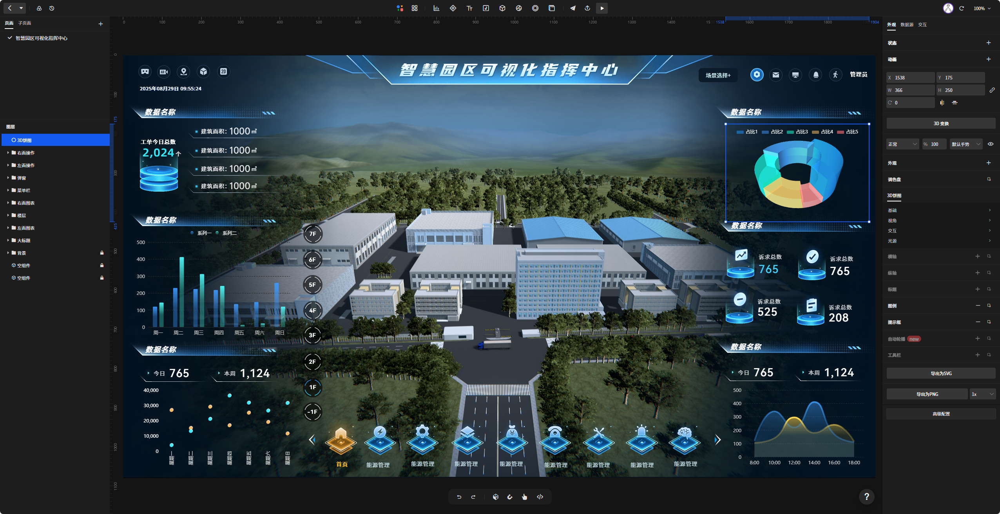
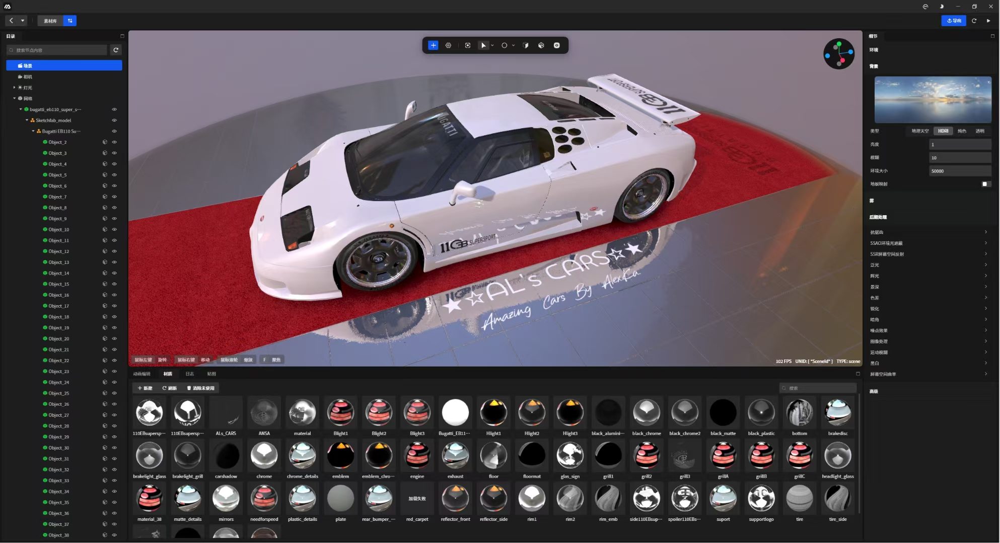
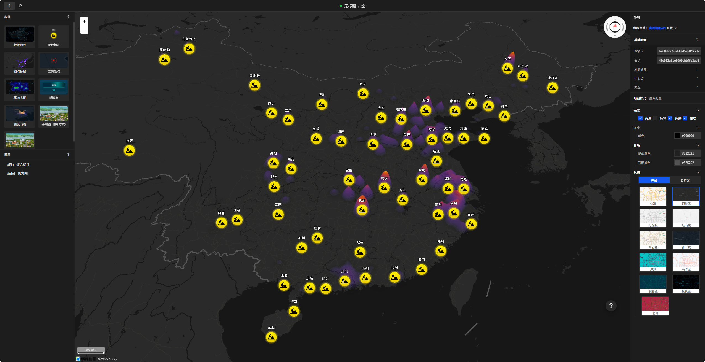
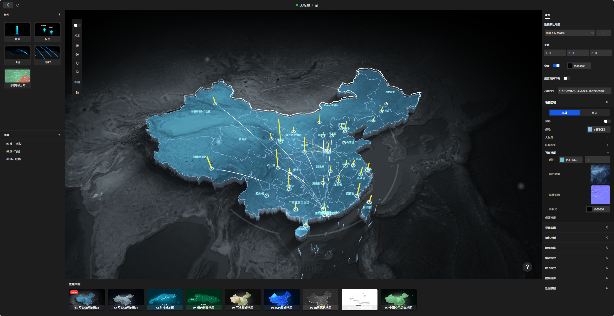
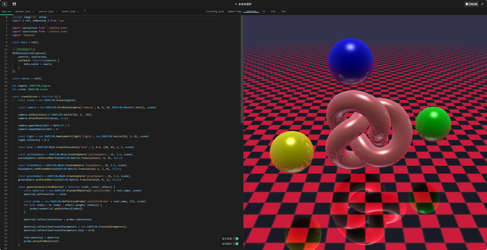
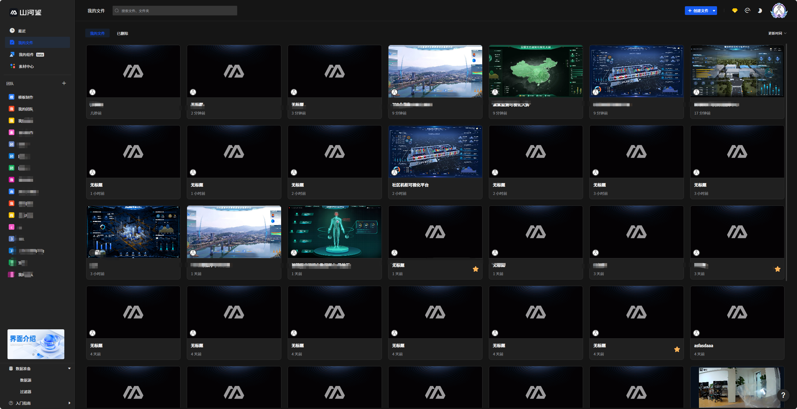
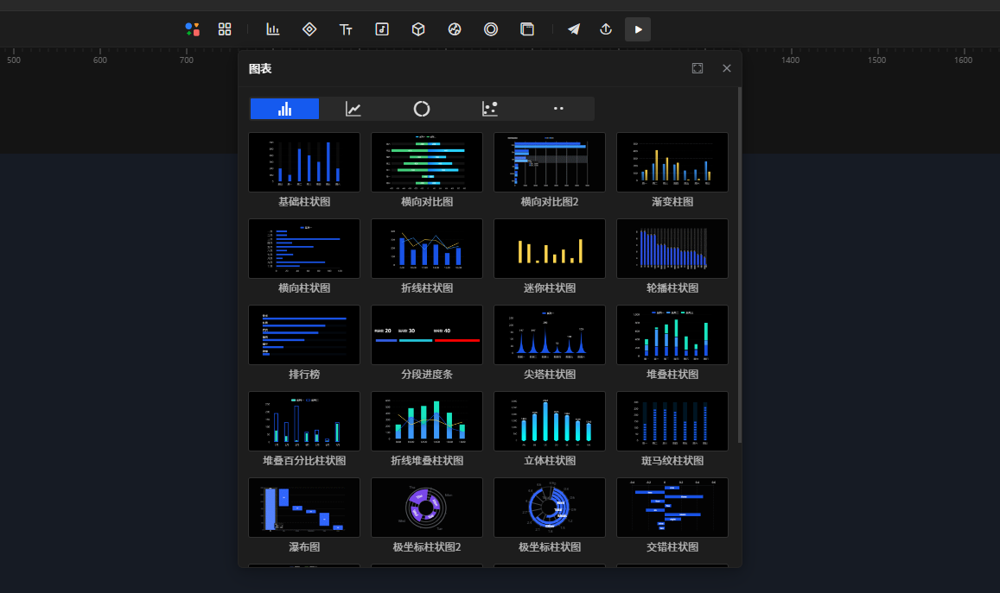
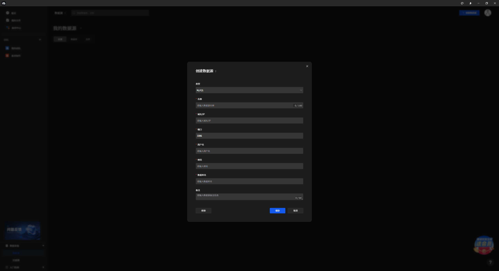
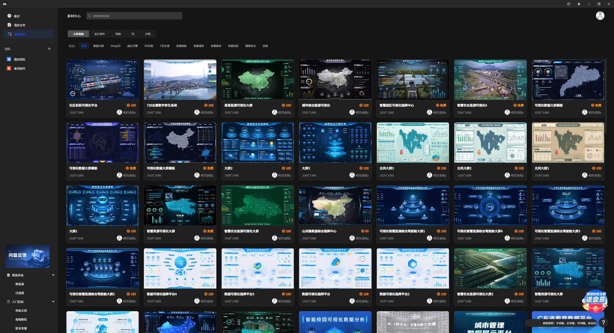
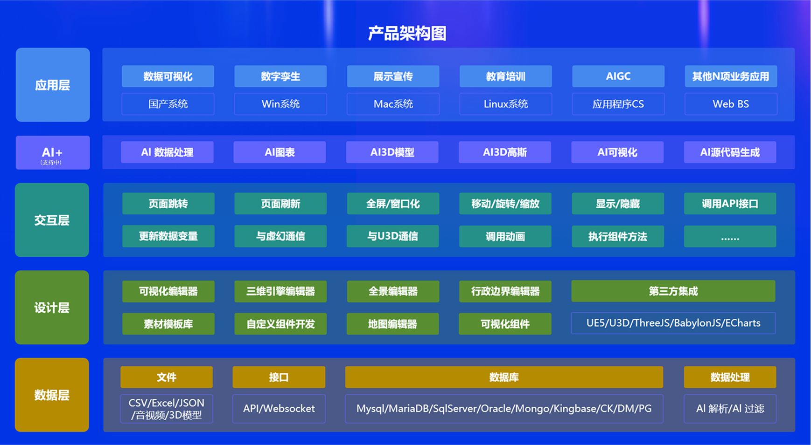

<br />
<div align="center" style="background: #fff; margin-bottom: 20px;">


[English](./README.en.md) | 简体中文
</div>

<br />
<div align="center">
<p><strong>自由创作 所想所得</strong></p>
  <p>您设计，我们生成源码和应用程序，随时可以展示、发布或二次开发。</p>
  
  [](https://github.com/your-org/open-shj-visual)
  [](LICENSE)
  [](https://shj.studio/website/)
  
  [🌐 官网](https://shj.studio/website/) | [📖 文档](https://shj.studio/website/) | [💬 社区](https://github.com/your-org/open-shj-visual/discussions) | [🐛 反馈](https://github.com/your-org/open-shj-visual/issues)
</div>

## 介绍

> 开源版本说明: 本开源版本主要用于学习和研究目的，提供完整的数据可视化功能。商业级的源码导出功能仅在[官网线上版本](https://shj.studio/website/)中提供。

山河鉴是一款自主可控、国产自研的低代码数据 3D 可视化工具，致力于为用户提供专业、高效、开放的数据可视化解决方案。通过可视化拖拽操作，让数据分析师、设计师、开发者都能轻松创建出色的数据可视化作品，将传统数周的开发工作压缩至数小时完成。工具基于 Vue 3 + TypeScript + Electron 等现代前端技术栈，支持团队协作、自定义组件开发，适用于企业数字化、政府数字化、教育科研等多种场景。

### 主编辑器

<div align="center">
  
</div>

### 特性展示

<div align="center">
  <table>
    <tr>
      <td width="33.33%" align="center">
        
        <br/><sub><b>自研3D编辑器（开发中）</b></sub>
      </td>
      <td width="33.33%" align="center">
        
        <br/><sub><b>高德编辑器</b></sub>
      </td>
      <td width="33.33%" align="center">
        
        <br/><sub><b>720VR全景编辑器（即将）</b></sub>
      </td>
    </tr>
    <tr>
      <td width="33.33%" align="center">
        
        <br/><sub><b>3D行政编辑器（即将）</b></sub>
      </td>
      <td width="33.33%" align="center">
        
        <br/><sub><b>自定义组件（即将）</b></sub>
      </td>
      <td width="33.33%" align="center">
        
        <br/><sub><b>团队/文件管理</b></sub>
      </td>
    </tr>
    <tr>
      <td width="33.33%" align="center">
        
        <br/><sub><b>组件库</b></sub>
      </td>
      <td width="33.33%" align="center">
        
        <br/><sub><b>数据库</b></sub>
      </td>
      <td width="33.33%" align="center">
        
        <br/><sub><b>素材库</b></sub>
      </td>
    </tr>
  </table>
</div>

### 技术架构

```
技术栈
├── 前端框架: Vue 3 + TypeScript + Vite
├── 桌面应用: Electron + Electron Builder
├── UI组件: Element Plus
├── 数据可视化: ECharts + Three.js + Babylon.js
├── 状态管理: Pinia + Vue Router 4
├── 样式处理: SCSS + 响应式设计
├── 代码编辑: Monaco Editor
├── 高性能计算: WebAssembly (Rust)
├── 数据连接: 多数据库 + API + WebSocket + 文件
└── 交互系统: 事件驱动 + 动画引擎 + 游戏引擎集成
└── ...
```

## 核心特性


<div align="center">
  
</div>

### 设计

- 拖拽式界面: 无需编程基础，通过可视化操作快速构建专业级数据可视化应用
- 120+ 组件库: 涵盖图表、3D、交互、媒体等多种组件类型，满足不同场景需求
- 自定义组件: 支持在线 Vue3 组件开发，可扩展个性化组件并集成到工具
- 3D 引擎：自研 3D Web 引擎编辑器展示自主研发能力
- 游戏引擎：虚幻引擎和 Unity 集成体现与主流引擎的兼容性
- 高德地图编辑器：自研高德地图可视化编辑器，无需代码配置，自定义地图风格样式，以及数据对接
- 3D地图编辑器：地图编辑器可以快速定制开发3D地图，自定义地图风格样式，以及数据对接
- 720全景编辑器：全景编辑器通过简单的配置，不仅支持全景图片/视频，也包括视频流监控接入、热点配置等常用功能

### 数据

- 多源数据接入: 支持静态数据、RESTful API、WebSocket 实时数据等多种数据源
- 数据库直连: 原生支持 MySQL、PostgreSQL、Oracle、SQL Server 等主流数据库
- 实时数据更新: 支持定时刷新、事件触发等多种数据更新机制
- 数据可视化: 提供丰富的图表类型和数据展示方式

### 交互

- 交互系统: 内置 19 种交互事件，支持复杂的用户交互逻辑设计
- 动画系统: 丰富的动画效果和过渡效果，提升用户体验
- 多状态管理: 支持页面状态切换，适应不同展示场景需求

### 导出（目前仅线上版本）

- 支持将当前编辑项目导出源代码工程，包含Vue/Springboot程序
- 支持导出编译后程序，包含dist/jar，无需编译直接部署
- 支持导出windows可执行程序，可制应用程序Logo、名称、版权

<br />

> 详细功能说明请参考: [功能列表](features.md)

## 快速开始

### 环境要求

- Node.js >= 16.0.0
- PNPM >= 7.0.0

### 安装步骤

```bash
# 1. 克隆项目
git clone https://********.git
cd open-shj-visual

# 2. 安装依赖
pnpm install

# 3. 启动开发环境
pnpm zerov:dev

# 4. 构建应用
# Windows
pnpm zerov:build:win
# macOS
pnpm zerov:build:mac
# Linux
pnpm zerov:build:linux
# Web
pnpm zerov:build:web
```

### 部署后端（Java）
> 查看`open-shj-visual-backend`分支


## 未来计划

1. 3D编辑器
2. AI模型、AI图表支持
3. AI 3D高斯编辑器
4. ...

## 社区与支持


### 资源

- 官方网站: [https://shjv.yuque.com/org-wiki-shjv-psfwkn/shj](https://shjv.yuque.com/org-wiki-shjv-psfwkn/shj)
- 官方文档: [https://shj.studio/website/](https://shj.studio/website/)
- 视频教程: B 站搜索"山河鉴可视化"

### 交流
- QQ群：795698425、805334126
- 微信社区: 扫描官网二维码加入
- GitHub Discussions: 技术讨论和问题解答
- 知乎: @山河鉴可视化
- B 站: @山河鉴可视化

<br />

<div style="display:flex; gap:4px;">
  
  
</div>

<br />
<br />

<div align="center">
  <p>如果这个项目对您有帮助，请给我们一个Star支持！⭐⭐⭐</p>
  <p>让我们一起构建更好的数据可视化生态！🚀</p>
</div>