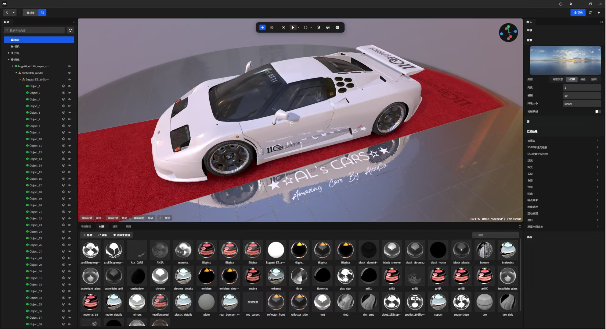
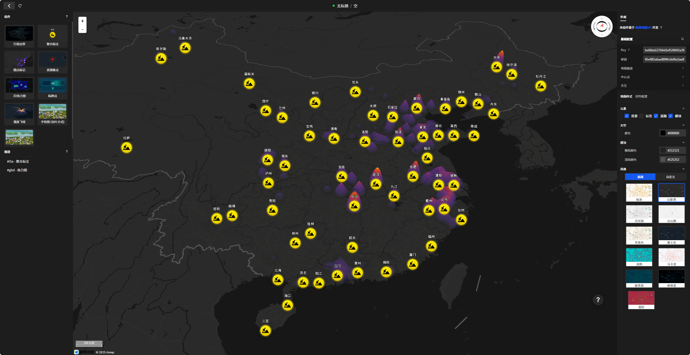
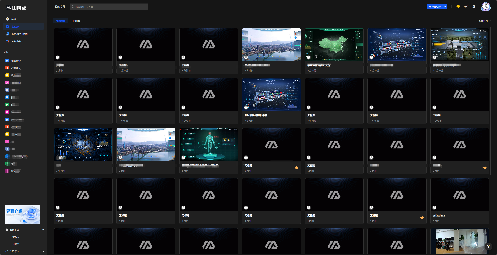

<br />
<div align="center" style="background: #fff; margin-bottom: 20px;">


English | [简体中文](./README.cn.md)
</div>
<br />
<div align="center">
<p><strong>Free Creation, What You See Is What You Get</strong></p>
  <p>You design, we generate source code and applications, ready to display, publish, or further develop.</p>
  
  [](https://github.com/your-org/open-shj-visual)
  [](LICENSE)
  [](https://shj.studio/website/)
  
  [🌐 Official Site](https://shj.studio/website/) | [📖 Docs](https://shj.studio/website/) | [💬 Community](https://github.com/your-org/open-shj-visual/discussions) | [🐛 Issues](https://github.com/your-org/open-shj-visual/issues)
</div>

## Overview

> Open Source Version Note: This open source version is mainly for learning and research purposes, providing complete data visualization features. commercial-grade source code export is only available in the [official online version](https://shj.studio/website/).

Shanhejian is an independent, domestically developed low-code 3D data visualization platform, dedicated to providing professional, efficient, and open data visualization solutions. Through visual drag-and-drop operations, data analysts, designers, and developers can easily create outstanding data visualization works, reducing weeks of traditional development to just hours. The platform is built on modern frontend technologies such as Vue 3, TypeScript, and Electron, supports team collaboration and custom component development, and is suitable for enterprise digitalization, government, education, and research scenarios.

### Editor

<div align="center">
  
</div>

### Feature

<div align="center">
  <table>
    <tr>
      <td width="33.33%" align="center">
        
        <br/><sub><b>Self-developed 3D Editor (Developing)</b></sub>
      </td>
      <td width="33.33%" align="center">
        
        <br/><sub><b>Gaode Editor</b></sub>
      </td>
      <td width="33.33%" align="center">
        
        <br/><sub><b>720VR Panorama Editor（Coming soon）</b></sub>
      </td>
    </tr>
    <tr>
      <td width="33.33%" align="center">
        
        <br/><sub><b>3D Administrative Editor（Coming soon）</b></sub>
      </td>
      <td width="33.33%" align="center">
        
        <br/><sub><b>Custom Components（Coming soon）</b></sub>
      </td>
      <td width="33.33%" align="center">
        
        <br/><sub><b>Team/File Management</b></sub>
      </td>
    </tr>
    <tr>
      <td width="33.33%" align="center">
        
        <br/><sub><b>Component Library</b></sub>
      </td>
      <td width="33.33%" align="center">
        
        <br/><sub><b>Database</b></sub>
      </td>
      <td width="33.33%" align="center">
        
        <br/><sub><b>Asset Library</b></sub>
      </td>
    </tr>
  </table>
</div>

### Technology Stack

```
Tech Stack
├── Frontend: Vue 3 + TypeScript + Vite
├── Desktop: Electron + Electron Builder
├── UI: Element Plus
├── Data Visualization: ECharts + Three.js + Babylon.js
├── State Management: Pinia + Vue Router 4
├── Styling: SCSS + Responsive Design
├── Code Editing: Monaco Editor
├── High Performance: WebAssembly (Rust)
├── Data Connection: Multiple Databases + API + WebSocket + Files
└── Interaction: Event-driven + Animation Engine + Game Engine Integration
└── ...
```

## Core Features

<div align="center">
  
</div>


### Design

- Drag-and-drop Interface: Build professional data visualization apps quickly without coding skills
- 120+ Component Library: Charts, 3D, interaction, media, and more for various scenarios
- Custom Components: Support Vue3 component development, extend personalized components and integrate into the platform
- 3D Engine: Proprietary 3D Web engine editor demonstrates independent R&D capabilities.
- Game Engine: Integration with Unreal Engine and Unity showcases compatibility with mainstream engines.
- Gaode Map Editor: Proprietary Gaode Map visual editor enables code-free configuration, custom map styles, and data integration.
- 3D Map Editor: The map editor allows rapid development of 3D maps, custom map styles, and data integration.
- 720° Panorama Editor: The panorama editor supports easy configuration for panoramic images/videos, video stream monitoring, hotspot setup, and other common features.

### Data

- Multi-source Data Access: Supports static data, RESTful API, WebSocket real-time data, and more
- Direct Database Connection: Native support for MySQL, PostgreSQL, Oracle, SQL Server, etc.
- Real-time Data Update: Scheduled refresh, event triggers, and more update mechanisms
- Data Visualization: Rich chart types and data display options

### Interaction

- Interaction System: 19 built-in interaction events, supports complex user interaction logic
- Animation System: Rich animation and transition effects for better user experience
- Multi-state Management: Page state switching for different display scenarios

### Export (Currently Online Version Only)

- Supports exporting the current editing project as a source code project, including Vue/Spring Boot programs
- Supports exporting compiled programs, including dist/jar files, ready for deployment without additional compilation
- Supports exporting Windows executable programs, with customizable application logo, name, and copyright

<br/>

> For detailed features, see: [Feature List](features.en.md)


## Quick Start

### Requirements

- Node.js >= 16.0.0
- PNPM >= 7.0.0

### Installation Steps

```bash
# 1. Clone the project
git clone https://********.git
cd open-shj-visual

# 2. Install dependencies
pnpm install

# 3. Start development environment
pnpm zerov:dev

# 4. Build the application
# Windows
pnpm zerov:build:win
# macOS
pnpm zerov:build:mac
# Linux
pnpm zerov:build:linux
# Web
pnpm zerov:build:web
```

### deploy backend（Java）
View the `open-shj-visual-backend` branch

## Future plans

1. 3D Editor
2. AI model and AI chart support
3. AI 3D Gaussian Editor
4. ...

## Community & Support

### Resources

- Official Wiki: [https://shjv.yuque.com/org-wiki-shjv-psfwkn/shj](https://shjv.yuque.com/org-wiki-shjv-psfwkn/shj)
- Official Docs: [https://shj.studio/website/](https://shj.studio/website/)
- Video Tutorials: Search "Shanhejian Visualization" on Bilibili


### Exchange

- QQ：795698425、805334126
- WeChat Community: Scan the QR code on the official site to join
- GitHub Discussions: Technical Q&A and discussions
- Zhihu: @Shanhejian Visualization
- Bilibili: @Shanhejian Visualization

<br />

<div style="display:flex; gap:4px;">
  
  
</div>

<br />
<br />

<div align="center">
  <p>If this project helps you, please give us a Star! ⭐⭐⭐</p>
  <p>Let's build a better data visualization ecosystem together! 🚀</p>
</div>